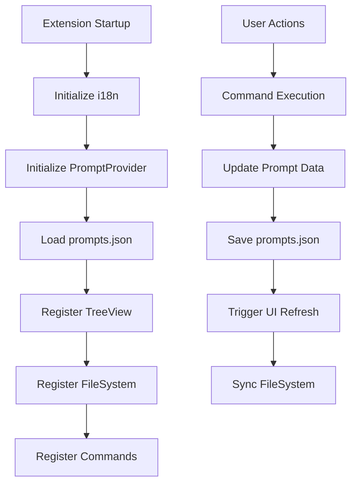

# Quick Prompt Development Guide

This document provides a complete guide for setting up the development environment and workflow for the Quick Prompt VS Code extension.

---

## 🛠️ Environment Setup

### System Requirements

* **Node.js** v18 or above (v20 recommended; required for `structuredClone` and modern ESM)
* **VS Code** v1.75.0 or above
* **TypeScript** (included in devDependencies)

### Setup Steps

#### 1. Project Initialization

```bash
# Clone the project and enter the directory
git clone https://github.com/winterdrive/QuickPrompt.git
cd QuickPrompt

# Install dependencies
npm install
```

#### 2. Compile TypeScript & Bundles

```bash
# Full build (CLI, MCP Server, and VSCode Extension)
npm run vscode:prepublish

# Individual builds
npm run build:qp    # Build CLI Fallback Bundle
npm run build:mcp   # Build MCP Server Bundle
npx tsc -p ./       # Compile VSCode Extension core
```

#### 3. Start Development Mode

There are two ways to start development mode:

##### Method A: Use VS Code Debugging

1. Open the project folder in VS Code
2. Press `F5` or use the Command Palette (`Cmd+Shift+P` / `Ctrl+Shift+P`)
3. Select "Debug: Start Debugging"
4. A new Extension Development Host window will open

##### Method B: Use Command Line

```bash
# macOS/Linux
code --extensionDevelopmentPath=. --new-window

# Windows
code.cmd --extensionDevelopmentPath=. --new-window
```

#### 4. Live Development & Debugging

##### Start TypeScript Watch Mode

```bash
# Start TypeScript watch mode for auto-compilation
npx tsc --watch

# Or use VS Code tasks
# Press Cmd+Shift+P → "Tasks: Run Task" → "tsc: watch - tsconfig.json"
```

##### Reload the Extension

In the Extension Development Host window:

* Press `Cmd+R` (macOS) or `Ctrl+R` (Windows/Linux) to reload
* Or use Command Palette → "Developer: Reload Window"

---

## 📁 Project Structure

### Directory Overview

```text
QuickPrompt/
├── .github/
│   └── workflows/
│       ├── validate.yml   # PR validation (type check, tests, VSIX build, manifest check)
│       └── publish.yml    # Marketplace publish (triggers on version bump in master)
├── .vscode/               # VS Code config files
├── dist/                  # TypeScript build output (excluded from git)
├── coverage/              # Jest coverage report (excluded from git)
├── out/                   # UI test compiled output (excluded from git)
├── i18n/                  # Internationalization files
│   ├── en.json
│   ├── zh-tw.json
│   └── zh-cn.json
├── src/
│   ├── ai/
│   │   ├── aiEngine.ts       # Local AI inference (Transformers.js)
│   │   ├── aiWorker.ts       # Async AI task worker
│   │   └── openAIClient.ts   # OpenAI-compatible client wrapper
│   ├── core/                 # Pure Node.js — no vscode dependency
│   │   ├── types.ts          # Shared types (Prompt, PromptVersion, MaskType, …)
│   │   ├── PromptManager.ts  # CRUD on prompts.json with optimistic locking
│   │   ├── VersionManager.ts # Version history CRUD with smart retention
│   │   ├── PathUtils.ts      # Path validation and JSON I/O helpers
│   │   ├── PrivacyManager.ts # Privacy facade (used by MCP server, no vscode dep)
│   │   └── index.ts
│   ├── mcp/
│   │   ├── SkillGenerator.ts # Generates AI Agent skill files (.mdc, etc.)
│   │   └── McpConfigPanel.ts # Webview for MCP configuration
│   ├── privacy/
│   │   ├── maskingEngine.ts      # Core masking orchestrator
│   │   ├── patternRegistry.ts    # Priority-based pattern registry
│   │   ├── types.ts
│   │   └── masking/
│   │       ├── patternEngine.ts  # Regex-based detection (18+ patterns)
│   │       └── secretStorage.ts  # OS-encrypted tokenMap (VS Code SecretStorage)
│   ├── services/
│   │   ├── titleGenerationService.ts
│   │   └── VersionHistoryService.ts
│   ├── commands/
│   │   └── versionCommands.ts
│   ├── test/                 # All test code (excluded from VSIX and base tsc)
│   │   ├── __mocks__/
│   │   │   └── vscode.ts     # Hand-written VSCode API stub (injected via moduleNameMapper)
│   │   ├── unit/             # Jest unit tests (pure Node.js, real tmp-dir I/O)
│   │   │   ├── pathUtils.test.ts
│   │   │   ├── promptManager.test.ts
│   │   │   └── versionManager.test.ts
│   │   └── ui/               # Mocha + vscode-extension-tester (real VSCode + Selenium)
│   │       └── quickPrompt.ui.test.ts
│   ├── extension.ts
│   ├── promptProvider.ts
│   ├── promptFileSystem.ts
│   ├── commands.ts
│   ├── clipboardManager.ts
│   └── i18n.ts
├── mcp-server/
│   └── src/
│       ├── index.ts
│       └── tools/
├── qp-entry.ts
├── jest.config.js          # Jest + ts-jest configuration
├── tsconfig.json           # Production TypeScript config (excludes src/test/)
├── tsconfig.test.json      # Unit test TypeScript config (adds jest types)
├── tsconfig.test.ui.json   # UI test TypeScript config (adds mocha types, outputs to out/)
├── package.json
├── package.nls.json
├── package.nls.zh-tw.json
├── package.nls.zh-cn.json
├── README.md
├── DEVELOPMENT.md
└── LICENSE
```

### Module Responsibilities

| Module File | Description | Main Class/Interface |
| --- | --- | --- |
| `extension.ts` | Extension lifecycle management, command registration | `activate()`, `deactivate()` |
| `src/mcp/SkillGenerator.ts` | Generates AI Agent skills with 4-layer action tree | `SkillGenerator` |
| `src/mcp/McpConfigPanel.ts` | Webview for easy agent-specific MCP configuration | `McpConfigPanel` |
| `mcp-server/index.ts` | MCP Server exposing 14 tools for LLM interaction (prompt CRUD + version history) | `McpServer` |
| `qp-entry.ts` | CLI entry for direct DB access (fallback mechanism) | `QuickPromptCLI` |
| `promptProvider.ts` | Implements `TreeDataProvider`, manages prompt data | `PromptProvider`, `PromptItem` |
| `promptFileSystem.ts` | Virtual file system for editing prompts in native VSCode editor | `PromptFileSystemProvider` |
| `ai/aiEngine.ts` | Local AI inference using `@huggingface/transformers` v3 (SmolLM2 / Qwen3) | `AIEngine` |
| `commands.ts` | Command handlers for prompt and clipboard operations | Various handler functions |
| `privacy/maskingEngine.ts` | Orchestrates pattern-based masking via PatternRegistry | `MaskingEngine` |
| `privacy/masking/patternEngine.ts` | Regex-based detection for emails, API keys, IPs, phone numbers, etc. (18 patterns) | `PatternEngine` |
| `privacy/masking/secretStorage.ts` | Per-prompt OS-encrypted tokenMap store via VS Code SecretStorage | `SecretStorageManager` |
| `core/PrivacyManager.ts` | Synchronous privacy facade used by MCP server (no vscode dependency) | `PrivacyManager` |
| `clipboardManager.ts` | Clipboard history tracking; stores original content without masking | `ClipboardManager` |
| `i18n.ts` | Internationalization utility, loads language files | `I18n` |

### Core Data Flow



---

## 🧪 Testing

### Architecture (Three Layers)

| Layer | Framework | Location | When to run |
| --- | --- | --- | --- |
| **Unit** | Jest + ts-jest | `src/test/unit/` | Always — fast, no VSCode needed |
| **Property** | Jest + fast-check | `src/test/properties/` | Drop `*.test.ts` files, runs with `npm test` |
| **UI / E2E** | Mocha + vscode-extension-tester | `src/test/ui/` | Manually or in a headed CI runner |

### Running Tests

```bash
# Run all unit tests
npm test

# Run with coverage report (enforces thresholds)
npm run test:coverage

# Watch mode for TDD
npm run test:watch

# UI tests — setup once, then run
npm run test:ui:setup   # downloads VSCode + ChromeDriver (~230 MB, cached)
npm run test:ui         # compiles UI tests and runs against real VSCode
```

### Coverage Thresholds

Enforced in `jest.config.js`. Violations fail `npm run test:coverage` and the CI pipeline.

| Metric | Threshold |
| --- | --- |
| Statements | 80 % |
| Branches | 70 % |
| Functions | 80 % |
| Lines | 80 % |

Current baseline (v0.5.0): ~95 % statements across `PromptManager`, `VersionManager`, `PathUtils`.

### VSCode Mock

`src/test/__mocks__/vscode.ts` is a hand-written stub injected at Jest's `moduleNameMapper` layer. Production files import from `'vscode'` normally; at test time Jest redirects to the mock with zero changes to source code.

When a test exercises a code path that calls a VSCode API not yet in the mock, add the missing stub there.

### TypeScript Compilation Contracts

* `tsconfig.json` — production compilation, **excludes** `src/test/`. This is what `vscode:prepublish` runs.
* `tsconfig.test.json` — unit test compilation, includes all `src/**/*`, adds `jest` to `types`.
* `tsconfig.test.ui.json` — UI test compilation, includes only `src/test/ui/**/*`, adds `mocha` to `types`, outputs to `out/`.

### CI

**`validate.yml`** — runs on every non-master push and on PRs to master:

1. Version bump check (PR only) — fails if release-relevant files changed without a version bump
2. `tsc -p ./` — production type check
3. `npm run test:coverage` — unit tests + coverage gate
4. `vsce package` — confirms the extension builds into a valid VSIX
5. Open VSX manifest display name check — catches encoding mismatches before publish

---

## 🌍 Internationalization (i18n)

Quick Prompt supports multiple languages out of the box.

### Supported Languages

* **English** (`en`)
* **Traditional Chinese** (`zh-tw`)
* **Simplified Chinese** (`zh-cn`)

### How It Works

1. **package.json**: Uses `%key%` placeholders that reference `package.nls.json` files
2. **Runtime Messages**: Uses `I18n.getMessage()` to load strings from `i18n/*.json` files
3. **Auto-detection**: Automatically loads the correct language based on VS Code's locale setting

### Adding a New Language

1. Create `package.nls.[locale].json` (e.g., `package.nls.ja.json` for Japanese)
2. Create `i18n/[locale].json` (e.g., `i18n/ja.json`)
3. Translate all strings from the English versions
4. Test by setting VS Code locale to your language

---

## 🔧 Common Development Issues

### Q: Compile error "Cannot find module 'vscode'"

```bash
# Make sure the correct @types/vscode version is installed
npm install --save-dev @types/vscode@^1.75.0
```

### Q: Extension does not appear in Extension Development Host

* Check if the `main` field in `package.json` points to the correct build file
* Ensure TypeScript compiles without errors
* Check Developer Tools Console for errors

### Q: Code changes are not reflected

* Make sure TypeScript has recompiled (check the `dist/` folder)
* Reload the window in Extension Development Host (`Cmd+R`)

### Q: `npm test` fails with "Cannot find name 'expect'"

The unit test files are being compiled by the base `tsconfig.json` which has no `jest` types. Make sure `tsconfig.json` has `"exclude": ["src/test"]`. Run `npx tsc -p ./` to verify.

### Q: `test:ui:setup` fails with TypeScript errors in `src/test/__mocks__/vscode.ts`

The mock uses `jest.fn()` which requires jest types. The base tsconfig must exclude `src/test/`. See the fix above.

### Q: `test:ui` fails with "cannot find module 'chai'"

Run `npm install --save-dev @types/chai` to add the chai type declarations needed by the UI test compiler.

### Q: Coverage report shows < threshold — CI fails

Add more tests in `src/test/unit/` targeting the uncovered branches, or temporarily lower the threshold in `jest.config.js` with a comment explaining why.

### Q: i18n strings not showing correctly

* Check if the language file exists in `i18n/` directory
* Verify the locale code matches VS Code's language setting
* Ensure `I18n.initialize()` is called in `activate()`

---

## 🔁 Data Flow & Architecture

### Prompt Data Structure

```typescript
interface Prompt {
    id: string;           // Unique ID (e.g., "001", "002")
    title: string;        // Prompt title
    content: string;      // Prompt content (tokens if masked, e.g. "[EMAIL-1]")
    use_count: number;    // Usage count
    last_used: string;    // Last used date (ISO format)
    created_at: string;   // Creation date (ISO format)
    pinned?: boolean;     // Whether pinned
    order?: number;       // Manual sort order
    titleSource?: 'user' | 'ai';  // Title origin (user-entered or AI-generated)
    privacyMeta?: {
        maskedAt: number; // Timestamp of masking
        types: string[];  // Detected types e.g. ["EMAIL", "API_KEY"]
        // tokenMap is stored in VS Code SecretStorage — never on disk
    };
}
```

### Storage Location

* **Workspace Mode**: `.vscode/prompts.json` (recommended, workspace-specific)
* **Fallback Mode**: Extension directory (when no workspace is open)

### Virtual File System

Quick Prompt uses a custom file system provider (`prompt-sniper://`) to allow editing prompts in the native VSCode editor:

* **URI Format**: `prompt-sniper://prompt/{id}.txt`
* **Two-way Sync**: Changes in the editor automatically update `prompts.json`
* **Native Experience**: Full VSCode editing features (syntax highlighting, undo/redo, etc.)

---

## 🚀 Publishing & Deployment

### Local Testing

1. Ensure TypeScript compiles without errors
2. Test all features in Extension Development Host
3. Check version and dependencies in package.json

### Package Extension

```bash
# Install vsce (Visual Studio Code Extension manager)
npm install -g vsce

# Package as .vsix file
vsce package

# Publish to VS Code Marketplace
vsce publish
```

### Version Management

```bash
# Update version
npm version patch  # Patch version (0.0.1 → 0.0.2)
npm version minor  # Minor version (0.0.1 → 0.1.0)
npm version major  # Major version (0.0.1 → 1.0.0)
```

---

## 🤝 Contribution Guide

### Development Workflow

1. Fork the project and create a feature branch
2. Follow the existing code style and architecture
3. Add appropriate comments and documentation
4. Test new features or fixes
5. Submit a Pull Request

### Code Style

* Use TypeScript strict mode
* Follow existing naming conventions
* Use JSDoc comments where appropriate
* Keep functions focused and modular

### Testing Checklist

* [ ] `npm test` passes with zero failures
* [ ] `npm run test:coverage` passes all thresholds (no red lines in report)
* [ ] `npx tsc -p ./` compiles without errors
* [ ] All features work in Extension Development Host (`F5`)
* [ ] i18n strings work in all supported languages
* [ ] Virtual file system editing works
* [ ] Commands work from both sidebar and command palette
* [ ] Workspace isolation works correctly

---

## 📚 Resources

* [VS Code Extension API](https://code.visualstudio.com/api)
* [VS Code Extension Guidelines](https://code.visualstudio.com/api/references/extension-guidelines)
* [TreeView API Documentation](https://code.visualstudio.com/api/extension-guides/tree-view)
* [FileSystemProvider API](https://code.visualstudio.com/api/references/vscode-api#FileSystemProvider)
* [Internationalization Guide](https://code.visualstudio.com/api/working-with-extensions/publishing-extension#internationalization)
