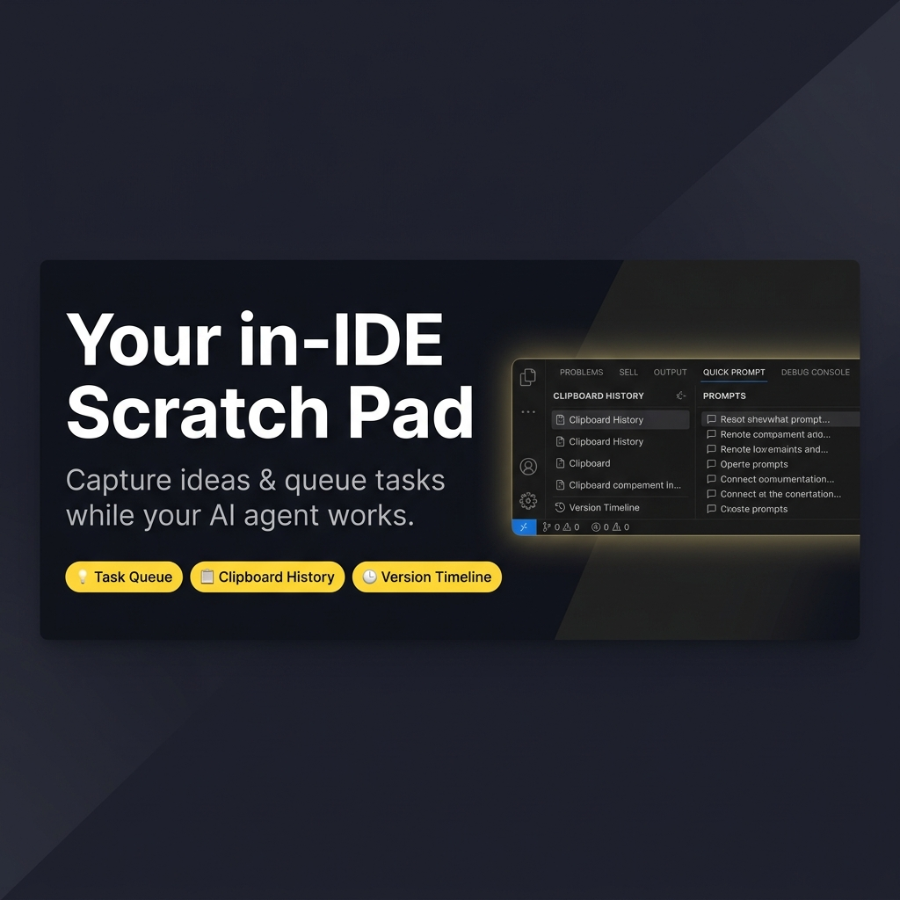
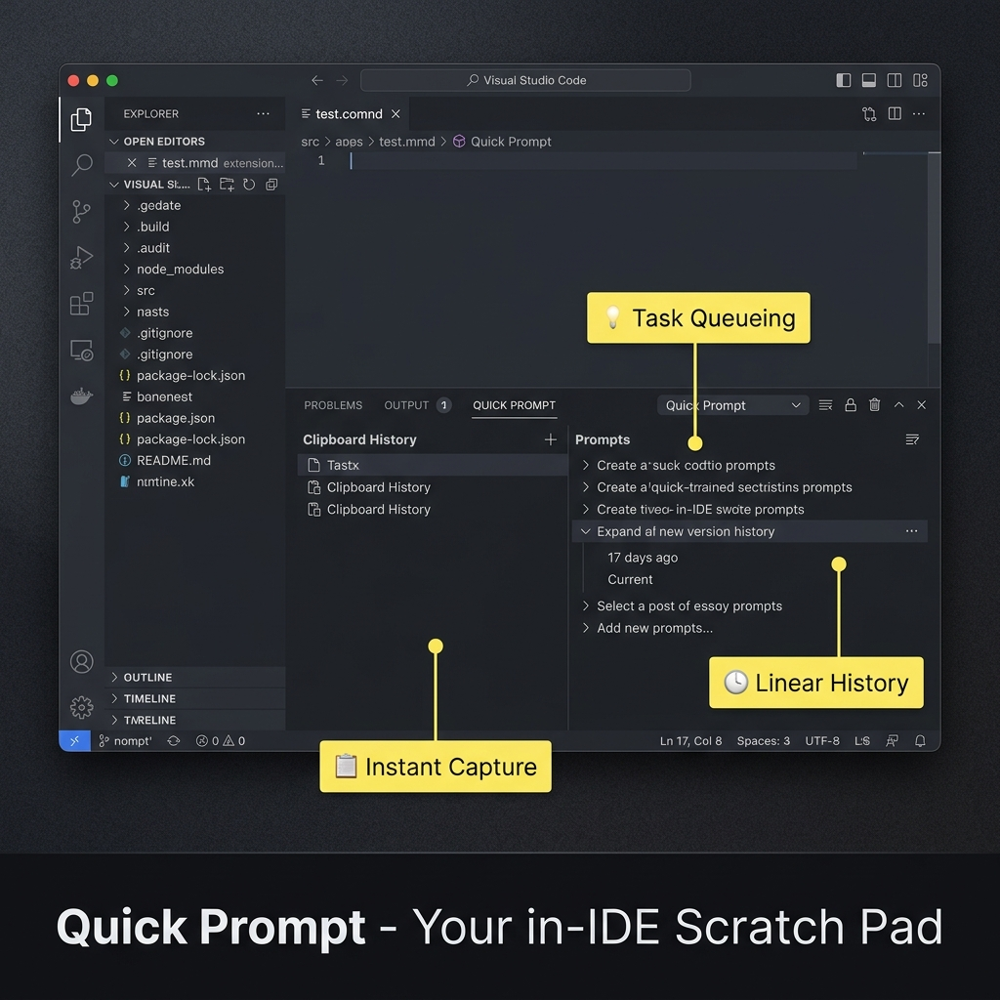
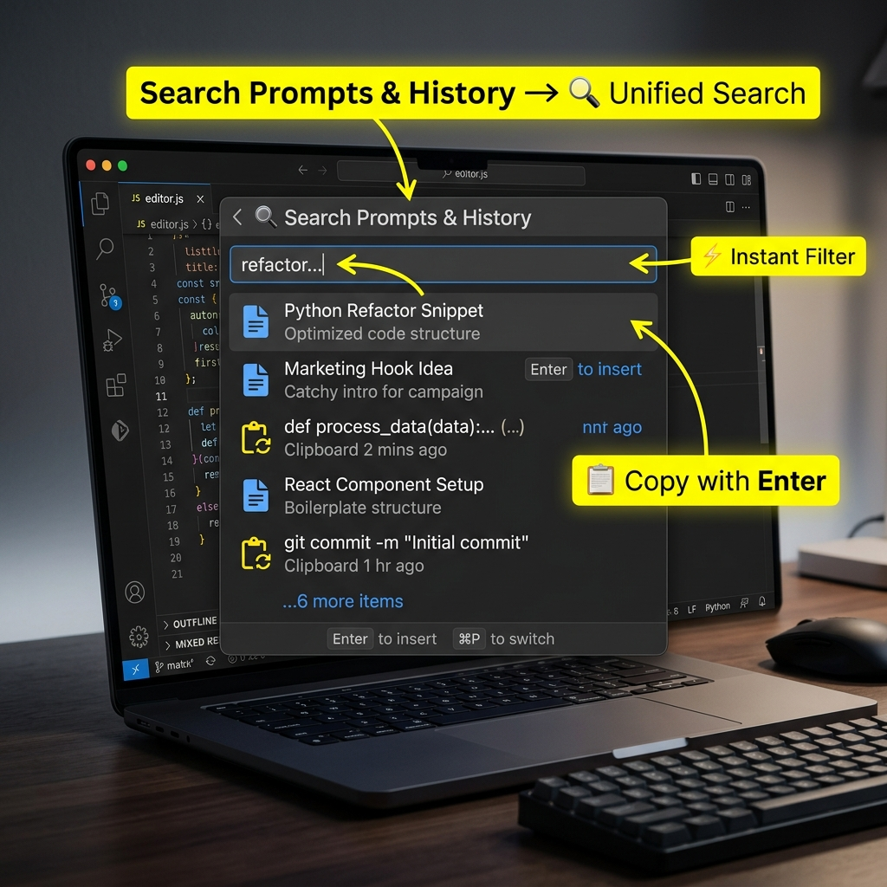

# Quick Prompt – AI 工作時，同步捕捉想法與排隊任務

<!--  -->
<!--  -->

[繁體中文](./README.zh-TW.md) | [日本語](./README.ja.md) | [한국어](./README.ko.md) | [简体中文](./README.zh-CN.md) | [English](../README.md)

---

## 🚀 什麼是 Quick Prompt？

**AI Agent 在執行任務的時候，你的腦子不會停下來。** Quick Prompt 是你的 **IDE 內建便條紙** ——隨手記下下一步任務、暫存可重用片段、追蹤剪貼簿歷史——不用切換到 Notepad++，不打斷你的思維流。

它結合了**持久化片段庫**與**剪貼簿歷史追蹤**，讓你*在 AI 工作時*產生的想法，在它完成的那一刻就能立即派上用場。

---

---

## 🔌 v0.3.0 重大更新：AI Agent 深度整合 (MCP)

**全方位的 Model Context Protocol (MCP) 支援正式登場。** 徹底擺脫手動複製貼上——讓您的 AI 助手（Cursor, Copilot, Claude 等）透過原生工具直接管理您的提示詞。

### 🛡️ 四層安全行動決策樹 (Safety Decision Tree)

每一個產生的 Skill 都內建了防呆與安全邏輯，確保 AI 在執行時穩定可靠：

1. **Layer 0: 連線閘門 (Connection Gate)** — 自動透過 `list_prompts` 測試連線。若 MCP 斷線，Agent 會立即觸發 HALT 煞車並詢問用戶是否降級處理。
2. **Layer 1: 標準 MCP 工具** — 提供 14 個優化過的工具，涵蓋 Prompt 的增刪改查與版本歷史。
3. **Layer 2: 安全驗證** — 在執行敏感操作前進行二次邏輯檢查，確保資料一致性。
4. **Layer 3: CLI 硬核後備 (Hard Fallback)** — 當 MCP server 無法使用時，Agent 可切換呼叫內建的 `qp.bundle.js` 腳本直接操作資料庫。

### ⚙️ 多客戶端一鍵設定

針對主流 AI 工具提供一鍵產出設定。執行指令：`Quick Prompt: Show MCP Config` 即可開啟互動式面板。

| Cursor / Antigravity | GitHub Copilot / Cline | Kiro IDE / Claude Code |
| :------------------- | :--------------------- | :--------------------- |
| 支援 `${workspaceFolder}` 動態變數 | 絕對路徑綁定 | 直接產出 JSON 配置區塊 |

---

## ✨ 核心特色

### 🔌 AI Agent 強大武裝 (New!)

- **🔌 21 個 MCP 工具**：為 AI Agent 提供完整的 Prompt 管理工具箱。
- **🛡️ 行動決策樹**：確保 Agent 只在連線安全且邏輯通順時執行變更。
- **📦 CLI 後備腳本**：斷線時的終極保險，內置於 generated skill 資料夾內。
- **⚙️ 互動式設定面板**：輕鬆完成各類 AI 工具的環境配置。

### 📚 提示詞管理 (Prompt Management)

- **🤖 AI 智慧標題**：使用本地 AI 模型（SmolLM2 / Qwen3，可自選）自動生成語義化標題。
- **🎯 極速搜尋**：按 `Alt+P` 搜尋 Prompt，按 Enter 直接複製。
- **🚀 快速新增**：選取文字按 `Alt+Shift+S` 立即新增。
- **✏️ 原生編輯**：像編輯一般檔案一樣編輯 Prompt，完整支援 VSCode 功能。

### 🕒 版本控制 (Version Control)

- **🕒 線性歷史**：每次儲存自動建立新版本。
- **📌 里程碑**：標記穩定版本或重要草稿。
- **⚖️ 差異比對**：視覺化檢視修改內容。

### 🔒 隱私保護 (Privacy Protection)

- **🔒 遮罩 Prompt**：右鍵點擊任一 Prompt → `Mask Prompt`，敏感資料立即替換為 Token（`[EMAIL-1]`、`[API-KEY-1]`…）。
- **🔓 解除遮罩**：右鍵 → `Unmask Prompt` 即時還原原始內容。
- **🔑 OS 加密儲存**：還原對照表存入 VS Code SecretStorage（OS Keychain），以系統加密形式持久保存，不以明文寫入任何檔案。

## 📸 操作截圖 (AI Generated)

### 介面總覽

*真實的底部控制面板視圖：剪貼簿歷史（左）與支援線性歷史紀錄的 Prompt 列表（右）*

### 快速搜尋功能

*整合式的 Quick Pick 介面，一鍵搜尋你的暫存區與剪貼簿歷史*

## 🚀 快速開始

### 安裝後首次使用

1. 在 VSCode 中開啟任一專案資料夾
2. 擴充功能會自動在 `.vscode/prompts.json` 建立預設檔案
3. 按 `Alt+P`（Mac 使用 `Opt+P`）開始使用

### 基本操作

#### 方法一：快速搜尋（推薦）⚡

1. 按 `Alt+P` 開啟搜尋框
2. 輸入關鍵字篩選 Prompt
3. 按 `Enter` 複製到剪貼簿（自動增加使用次數）
4. 切換到任何地方（Copilot、Agent、瀏覽器等）按 `Ctrl+V` 貼上

#### 方法二：側邊欄操作 📋

1. 點擊活動列的 Quick Prompt 圖示（對話氣泡）
2. **My Prompts** 區塊：
    - 點擊任一 Prompt 即可複製
    - 右鍵點擊可上下移動
    - 行內按鈕：複製、釘選、編輯、刪除
3. **Clipboard History** 區塊：
    - 點擊即可複製
    - 點擊釘選圖示可轉為永久 Prompt

### 圖示說明

- 🔥：熱門（使用 >= 10 次）
- ⭐：常用（使用 >= 5 次）
- 📝：一般（使用 > 0 次）
- ⚪：未使用
- 📌：已釘選

## 📝 新增與編輯

### 新增 Prompt

#### 方法 1：從選取文字新增（最快）🚀

1. 在編輯器中選取一段文字
2. 右鍵選擇「Quick Add Prompt (Selection)」（或按 `Alt+Shift+S`）
3. 完成！自動生成標題並儲存

#### 方法 2：智慧新增模式 ⚡

1. 點擊側邊欄標題列的 **➕ 新增** 按鈕
2. 在輸入框中：
    - **自動模式**：直接貼上內容，按 Enter（自動生成標題）
    - **手動模式**：使用 `標題::內容` 格式
3. 完成！

#### 方法 3：從剪貼簿歷史

1. 在 Clipboard History 找到該項目
2. 點擊 **📌 釘選** 按鈕
3. 自動轉為永久 Prompt

### 編輯 Prompt

- 點擊 **✏️ 編輯** 按鈕開啟原生編輯器
- 像編輯一般檔案一樣修改內容
- 按 `Ctrl+S` 儲存
- 支援復原/重做 (Undo/Redo)、自動儲存、格式化文件

### 使用版本歷史 (最新功能)

1. **查看歷史**：在側邊欄展開任何 Prompt。
2. **比較**：點擊任何歷史版本開啟 **Diff View**。
3. **還原**：右鍵點擊版本並選擇 **套用版本** 來還原。
4. **里程碑**：將重要版本標記為里程碑（如 "v1.0 正式版"）。

## 🔒 隱私保護 – 使用指南

在內容送往任何 AI 模型前，先遮罩敏感資料。

### 操作流程

1. 新增含敏感資料的 Prompt — 側邊欄顯示**黃色盾牌**警示
2. 右鍵點擊 → **`Mask Prompt`**
3. 敏感值被替換為 `[EMAIL-1]`、`[API-KEY-1]` 等 Token；Prompt 顯示**綠色盾牌**
4. 複製或插入 Prompt — Agent 只會收到 Token，永遠看不到原始值
5. 右鍵 → **`Unmask Prompt`** 即時還原

> **安全模型**：還原對照表（Token → 原始值）存入 VS Code **SecretStorage**（macOS Keychain / Windows Credential Manager），永遠不寫入 `prompts.json` 或任何磁碟檔案。Unmask 僅限本機，切換電腦後無法還原已遮罩的 Prompt。

### 預設偵測規則

- Email 地址 → `[EMAIL-1]`
- 電話號碼 → `[PHONE-1]`
- API 金鑰（AWS、GitHub、OpenAI 等）→ `[API-KEY-1]`
- IP 位址 → `[IP-ADDRESS-1]`
- 私鑰 / 憑證 → `[PRIVATE-KEY-1]`
- 信用卡號 → `[CREDIT-CARD-1]` *(預設關閉)*

### 隱私相關設定

- `quickPrompt.privacy.enabled`：啟用/停用所有隱私功能（預設：`true`）
- `quickPrompt.privacy.patterns.email`：遮罩 Email（預設：`true`）
- `quickPrompt.privacy.patterns.phone`：遮罩電話（預設：`true`）
- `quickPrompt.privacy.patterns.apiKeys`：遮罩 API 金鑰（預設：`true`）
- `quickPrompt.privacy.patterns.ipAddress`：遮罩 IP 位址（預設：`true`）
- `quickPrompt.privacy.patterns.privateKey`：遮罩私鑰（預設：`true`）
- `quickPrompt.privacy.patterns.creditCard`：遮罩信用卡號（預設：`false`）

---

## ⚙️ 設定

### AI 功能設定

- `quickPrompt.ai.enabled`: 啟用/停用 AI 功能（預設：`true`）
- `quickPrompt.ai.autoGenerateTitle`: 自動生成標題（預設：`true`）

### 剪貼簿設定

- `quickPrompt.clipboardHistory.enabled`: 啟用/停用自動追蹤（預設：`true`）
- `quickPrompt.clipboardHistory.maxItems`: 最大歷史紀錄數量（預設：`20`）
- `quickPrompt.clipboardHistory.minLength`: 最小內容長度（預設：`10`）

### 檔案位置

- **工作區模式**：`.vscode/prompts.json`（每個專案獨立）
- **備用模式**：如果沒有開啟工作區，會使用擴充功能目錄

### 快捷鍵

| 功能        | Windows/Linux | Mac           |
|-----------|---------------|---------------|
| 搜尋 Prompt | `Alt+P`       | `Opt+P`       |
| 從選取新增     | `Alt+Shift+S` | `Opt+Shift+S` |

### 給自動化使用的 Command ID

Quick Prompt v0.5.1 將擴充功能命令統一到 `quickPrompt.*` namespace。Command Palette 顯示名稱與預設快捷鍵不變，但如果你有自訂 `keybindings.json`、macro extension、task，或外部 automation，請改用下列表格中的命令 ID。

| 動作 | Command ID |
|------|------------|
| 搜尋 Prompt 與剪貼簿歷史 | `quickPrompt.search` |
| 新增 Prompt | `quickPrompt.addPrompt` |
| 以自訂標題新增 Prompt | `quickPrompt.addPromptWithTitle` |
| 從選取文字快速新增 | `quickPrompt.silentAdd` |
| 編輯 Prompt | `quickPrompt.editPrompt` |
| 重新命名 Prompt | `quickPrompt.renamePrompt` |
| 刪除 Prompt | `quickPrompt.deletePrompt` |
| 釘選 / 取消釘選 | `quickPrompt.togglePin` |
| 顯示 MCP 設定 | `quickPrompt.showMcpConfig` |
| 產生 Skill 檔案 | `quickPrompt.generateSkill` |
| 測試 AI 連線 | `quickPrompt.testAIConnection` |

虛擬 Prompt 編輯器分頁現在使用 `quickprompt:` URI scheme。既有 Prompt 資料與設定不會被改動，但先前由 VS Code session restore 還原的舊虛擬編輯器分頁，或外部連到舊虛擬 URI 的連結，可能需要從 Quick Prompt 側邊欄重新開啟。

## 💡 最佳實踐

1. **等待時排隊**：AI 開始跑長任務時，立刻打開 Quick Prompt，把接下來的想法記下來——別讓靈感溜走
2. **隨手捕捉**：看到值得留存的內容？選取後按 `Alt+Shift+S`，標題自動生成
3. **讓剪貼簿歷史當安全網**：放心複製，最近 20 筆複製記錄隨時可撈回（可透過 `maxItems` 調整上限）
4. **釘選常用片段**：把一次性剪貼簿項目一鍵升格為永久條目
5. **加入 Git**：提交 `.vscode/prompts.json`，讓整個團隊共享同一份可重用片段庫

## 🤝 推薦搭配

### 🗂️ VirtualTabs

**降低 AI 協作的認知負荷。**

**Quick Prompt** 讓你的思緒在 IDE 內保持整齊。搭配 **VirtualTabs** 讓工作區也同樣整齊。

- **Quick Prompt**：*AI 工作時*，捕捉你腦中正在想的事
- **VirtualTabs**：跨任何目錄，整理哪些檔案屬於哪個任務

在 [**VS Code Marketplace**](https://marketplace.visualstudio.com/items?itemName=winterdrive.virtual-tabs) | [**Open VSX Registry**](https://open-vsx.org/extension/winterdrive/virtual-tabs) 取得 VirtualTabs

---

## ❤️ 支持專案

如果您覺得這個擴充功能對您有幫助，歡迎小額贊助支持開發！

## 📄 授權

MIT License

---

**別再讓切換視窗吃掉你的靈感。** 🚀

*Made with ❤️ for developers who think faster than their agents run*
